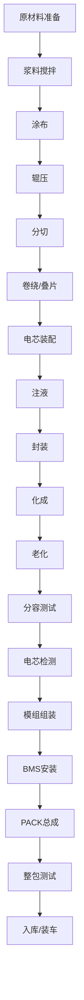

```mermaid
flowchart TD
A[原材料准备] --> B[浆料搅拌]
B --> C[涂布]
C --> D[辊压]
D --> E[分切]
E --> F[卷绕/叠片]

F --> G[电芯装配]
G --> H[注液]
H --> I[封装]

I --> J[化成]
J --> K[老化]
K --> L[分容测试]

L --> M[电芯检测]
M --> N[模组组装]
N --> O[BMS安装]
O --> P[PACK总成]
P --> Q[整包测试]
Q --> R[入库/装车]
```
